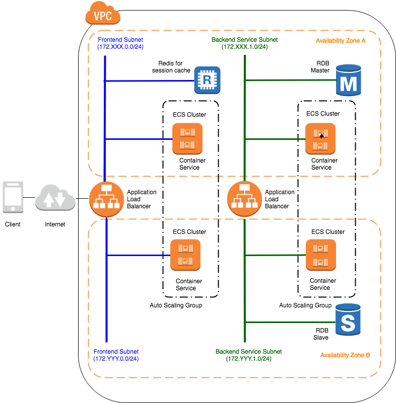
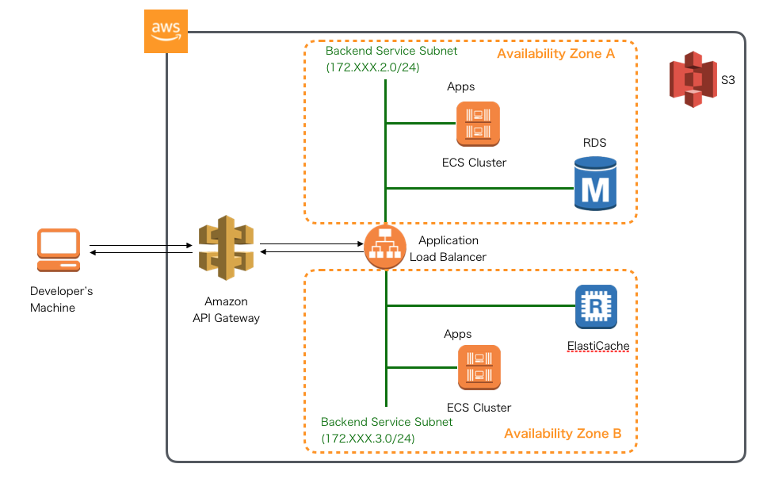

### JSUG 勉強会


<span style="font-size:28px">AWSで作るクラウドネイティブアプリケーションの基本とDevOps</span>


2019.9 @KoheiKawabata

---

### 自己紹介

<p></p>
<ul style="float:right">
  <div style="font-size:18px">
  <li style="margin: 10px 0px 10px">名前：川畑 光平(KAWABATA Kohei)</li>
  <li style="margin: 10px 0px 10px">会社：(株)NTTデータ</li>
  <li style="margin: 10px 0px 10px">今の仕事：<span style="font-size:18px">プロジェクト支援(主にクラウド系)とR&amp;D</span></li>
  <li style="margin: 10px 0px 10px"><a href="https://aws.amazon.com/jp/blogs/psa/japan-apn-ambassador-2019/" target="_blank">2019 APN AWS Top Engineers &amp; Ambassadors</a></li>
  <li style="margin: 10px 0px 10px">マイナビ「ITSearch+」で記事連載中</li>
  </div>
</ul>

---

### 本日のトピックス


---

### その前に…

---

### How to use this slide

<br />

- ___黄色の文字はリンク___
- ___ESCキーを押すとスライドのオーバービュー___
- Altキー + マウスクリックで拡大ズーム
- J,K,M,Lキーでも遷移
- ___幾つかのスライドは下に遷移___

<span style="font-size:20px">
※当スライドは <a href="https://github.com/hakimel/reveal.js" target="_blank">「reveal.js」</a> を使って、GitHub Pages上に作成
</span>

---

### Agenda

- Backgroundと対象読者
- 記事のテーマ・トピックス紹介
  - AWSで作るクラウドネイティブアプリケーションの基本
  - AWSで実践！基盤・デプロイ自動化
- 各テーマのポイント
- 今後の記事公開予定

---

#### Background

<ul>
  <span style="font-size:24px">
    <li style="margin: 10px 0px 10px">
    Springのガイドラインは社内にもあったが、よく使われるAWSサービスの概要や使い方・設定方法などがドキュメントとして抜け落ちていた。
    </li>
    <li style="margin: 10px 0px 10px">
    ここ最近で支援したAWSプロジェクトでアプリケーション実装、R&D検証した内容を別のプロジェクトでも利用可能なよう汎用化
    </li>
    <li style="margin: 10px 0px 10px">
    幾つかのテーマに関して、AWSパートナーソリューションアーキテクトとも議論、内容を全社向けにフィードバック
    </li>
    <li style="margin: 10px 0px 10px">
    どうせなら社外に公開(マイナビへWeb記事として寄稿)
    </li>
  </span>
</ul>

---

#### 記事の対象読者

<ul>
  <span style="font-size:20px">
    <li style="margin: 15px 0px 15px">
    できるだけ学習コスト低く、AWSをベースとしたクラウドネイティブなアプリケーション開発のポイントを知りたい。とはいえ、最低以下のような経験は必要。
      <ul>
        <li>Java・SpringFrameworkを使ったことがある経験者</li>
        <li>Unix・LinuxなどのPOSIX系OS、Dockerコンテナを使ったことがある経験者</li>
        <li>MavenやGitといった開発ツールを使ったことがある経験者</li>
      </ul>
    </li>
    <li style="margin: 15px 0px 15px">
    AWSのマネージドサービスを可能な限り活用して、できるだけ少数のリソースで開発を行いたい。
    </li>
    <li style="margin: 15px 0px 15px">
    クラウドネイティブな実装方法からマイクロサービス、CI/CD、基盤自動化まで一貫したストーリーでのベースの雛形が欲しい。
    </li>
    <li style="margin: 15px 0px 15px">
    各テーマを一部切り取って、構築・実装の参考にしたい。
    </li>
  </span>
</ul>

***

### Article Topics


<span style="font-size:32px">AWSクラウドでよく利用される基本的なサービスの構築方法や、SpringBootをベースとしたアプリケーションを実装する際の基本事項をまとめた連載記事</span>

---

#### サーバレス編


<ul>
  <span style="font-size:24px">
  <li><a href="https://news.mynavi.jp/itsearch/article/devsoft/4316" target="_blank">(1)Spring Cloud Functionを使ったLambdaファンクション実装</a></li>
  <li><a href="https://news.mynavi.jp/itsearch/article/devsoft/4318" target="_blank">(2)AWS Lambdaの設定</a></li>
  <li><a href="https://news.mynavi.jp/itsearch/article/devsoft/4321" target="_blank">(3)Amazon API Gatewayの設定</a></li>
  </span>
</ul>

---

#### ECSコンテナ編


<ul style="float:right">
  <div style="font-size:18px">
  <li style="margin: 10px 0px 10px"><a href="https://news.mynavi.jp/itsearch/article/devsoft/4354" target="_blank">(4)VPC(Virtual Private Cloud)の構築</a></li>
  <li style="margin: 10px 0px 10px"><a href="https://news.mynavi.jp/itsearch/article/devsoft/4359" target="_blank">(5)ALB(Application Load Balancer)の構築</a></li>
  <li style="margin: 10px 0px 10px"><a href="https://news.mynavi.jp/itsearch/article/devsoft/4363" target="_blank">(6)SpringBootを使ったアプリケーション実装</a></li>
  <li style="margin: 10px 0px 10px"><a href="https://news.mynavi.jp/itsearch/article/devsoft/4390" target="_blank">(7)アプリケーションのDockerイメージの作成</a></li>
  <li style="margin: 10px 0px 10px"><a href="https://news.mynavi.jp/itsearch/article/devsoft/4405" target="_blank">(8)ECSクラスタの構築</a></li>
  <li style="margin: 10px 0px 10px"><a href="https://news.mynavi.jp/itsearch/article/devsoft/4408" target="_blank">(9)ECSタスクの定義</a></li>
  <li style="margin: 10px 0px 10px"><a href="https://news.mynavi.jp/itsearch/article/devsoft/4416" target="_blank">(10)ECSサービスの実行</a></li>
  </div>
</ul>
---

#### RDS(PostgreSQL)編


<ul>
  <div style="font-size:32px">
  <li><a href="https://news.mynavi.jp/itsearch/article/devsoft/4422" target="_blank">(11)RDS(RelationalDatabaseService)の構築</a></li>
  <li><a href="https://news.mynavi.jp/itsearch/article/devsoft/4426" target="_blank">(12〜13)Spring Cloud AWSとSpring Data JPAを使った実装</a></li>
  </div>
</ul>
---

#### NoSQL編


---

#### NoSQL編

<ul>
  <div style="font-size:32px">
  <li style="margin: 10px 0px 10px"><a href="https://news.mynavi.jp/itsearch/article/devsoft/4473" target="_blank">(14)NoSQL基礎解説(CAP定理による分類)</a></li>
  <li style="margin: 10px 0px 10px"><a href="https://news.mynavi.jp/itsearch/article/devsoft/4479" target="_blank">(15)NoSQL基礎解説(AP型データベースの特徴)</a></li>
  <li style="margin: 10px 0px 10px"><a href="https://news.mynavi.jp/itsearch/article/devsoft/4498" target="_blank">(16)AmazonDynamoDBの構築</a></li>
  <li style="margin: 10px 0px 10px"><a href="https://news.mynavi.jp/itsearch/article/devsoft/4506" target="_blank">(17〜18)Spring Data DynamoDBを使った実装</a></li>
  <li style="margin: 10px 0px 10px"><a href="https://news.mynavi.jp/itsearch/article/devsoft/4523" target="_blank">(19)ローカルRedisServerの構築</a></li>
  <li style="margin: 10px 0px 10px"><a href="https://news.mynavi.jp/itsearch/article/devsoft/4525" target="_blank">(20〜21)Spring SessionとSpring Data Redisを使った実装</a></li>
  <li style="margin: 10px 0px 10px"><a href="https://news.mynavi.jp/itsearch/article/devsoft/4543" target="_blank">(22)AmazonElastiCacheの構築</a></li>
  <li style="margin: 10px 0px 10px"><a href="https://news.mynavi.jp/itsearch/article/devsoft/4566" target="_blank">(23〜24)セッション共有するECSアプリケーション実装</a></li>
  </div>
</ul>

---

#### S3編


<ul>
  <div style="font-size:24px">
    <li><a href="https://news.mynavi.jp/itsearch/article/devsoft/4447" target="_blank">(25)AmazonS3バケットの構築とアップロード</a></li>
    <li><a href="https://news.mynavi.jp/itsearch/article/devsoft/4566" target="_blank">(26〜27)SpringCloudAWSを使ったファイルダウンロード・アップロード実装</a></li>
  </div>
</ul>

---

<span style="font-size:24px">STSを使ったクライアントからのS3へのファイルアップロード・ダウンロード</span>


<ul>
  <div style="font-size:24px">
    <li>AWSで作るクラウドネイティブアプリケーション発展編(仮)で解説予定</li>
    <li><a href="https://github.com/debugroom/mynavi-sample-aws-s3/tree/master/src/main/java/org/debugroom/mynavi/sample/aws/s3/app/web/helper" target="_blank">現在実装のみ公開</a></li>
  </div>
</ul>

---

#### SQS編(今月から)


<ul>
  <div style="font-size:24px">
    <li>SQS+SpringCloudAWSを使用したオンライン非同期処理パターン(Producer)</li>
    <li>ディレードバッチやクラウドサービスイベントトリガーパターン</li>
    <li>SQS+SpringCloudAWS+SpringBatch+ECSTaskScheduler(Consumer)</li>
    <li><a href="https://github.com/debugroom/mynavi-sample-aws-sqs" target="_blank">現在実装のみ公開</a></li>
  </div>
</ul>


***
***
### Article Topics


<span style="font-size:32px">マイクロサービスアーキテクチャ(MSA)アプリケーションでDevOpsや基盤自動化する際の基本事項をまとめた連載記事</span>


---

<span style="font-size:24px">クラウドネイティブECSコンテナ編の環境でMSAアプリケーションを構築</span>



<ul>
  <span style="font-size:24px">
  <li><a href="https://news.mynavi.jp/itsearch/article/devsoft/4379" target="_blank">(1)MSAアプリケーションのOverview</a></li>
  </span>
</ul>

---

#### CI - 静的チェックツール環境導入編 -


<ul>
  <span style="font-size:24px">
  <li><a href="https://news.mynavi.jp/itsearch/article/devsoft/4463" target="_blank">(2)SonarQubeServerの構築</a></li>
  <li><a href="https://news.mynavi.jp/itsearch/article/devsoft/4466" target="_blank">(3)静的チェックルールの定義とSonarLintのIDEへの設定</a></li>
  </span>
</ul>

---

#### CI - SpringBootテストコード実装編 -


<ul>
  <span style="font-size:24px">
  <li><a href="https://news.mynavi.jp/itsearch/article/devsoft/4475" target="_blank">(4)マイクロサービスにおけるテスト自動化とテスト戦略</a></li>
  <li><a href="https://news.mynavi.jp/itsearch/article/devsoft/4486" target="_blank">(5)マイクロサービスアプリケーションのパッケージ構成</a></li>
  </span>
</ul>

---

<ul>
  <span style="font-size:32px">
  <li style="margin: 10px 0px 10px"><a href="https://news.mynavi.jp/itsearch/article/devsoft/4486" target="_blank">(5〜6)マイクロサービスにおける単体テストコード実装</a>
    <ul>
      <li style="margin: 10px 0px 10px">@DataJpaTestアノテーションの利用</li>
      <li style="margin: 10px 0px 10px">@SpringBootTestアノテーションの利用</li>
      <li style="margin: 10px 0px 10px">@WebMvcTestアノテーションの利用</li>
    </ul>
  </li>
  <li style="margin: 10px 0px 10px"><a href="https://news.mynavi.jp/itsearch/article/devsoft/4519" target="_blank">(7)マイクロサービスにおける結合テストコード実装</a>
    <ul>
      <li style="margin: 10px 0px 10px">DBUnitの利用</li>
      <li style="margin: 10px 0px 10px">TestRestTemplateの利用</li>
    </ul>
  </li>
  <li style="margin: 10px 0px 10px"><a href="https://news.mynavi.jp/itsearch/article/devsoft/4547" target="_blank">(8)マイクロサービスを呼び出す側の単体テストコード実装</a>
    <ul>
      <li style="margin: 10px 0px 10px">MockRestServiceServerの利用</li>
      <li style="margin: 10px 0px 10px">HTMLUnitの利用</li>
    </ul>
  </li>
  <li style="margin: 10px 0px 10px"><a href="https://news.mynavi.jp/itsearch/article/devsoft/4550" target="_blank">(9)マイクロサービスを含むEnd2Endテストコード実装</a>
    <ul>
      <li style="margin: 10px 0px 10px">Seleniumの利用</li>
    </ul>
  </li>
  </span>
</ul>

---

#### CI - AWS CodeBuildによるCI実践編 -


<ul>
  <span style="font-size:24px">
  <li><a href="https://news.mynavi.jp/itsearch/article/devsoft/4593" target="_blank">(10)CodeBuildの概要とCodeBuild Localの利用</a></li>
  <li><a href="https://news.mynavi.jp/itsearch/article/devsoft/4595" target="_blank">(11)CodeBuildの設定</a></li>
  </span>
</ul>

---

#### CI - AWS CodeBuildによるCI実践編 -

<span style="font-size:32px">GitHubフローをベースにしたブランチ戦略</span>


---

#### AWS CodePipelineによるCD実践編(今月から)


---

#### CD - AWS CodePipelineによるパイプライン1 -

<span style="font-size:24px">Backendコンテナイメージの作成・プッシュ</span>


---

#### CD - AWS CodePipelineによるパイプライン2 -

<span style="font-size:24px">ステージング環境へのBackendコンテナデプロイ</span>


---

#### CD - AWS CodePipelineによるパイプライン3 -

<span style="font-size:24px">WebアプリケーションでのE2Eテスト・コンテナイメージ作成</span>


---

#### CD - AWS CodePipelineによるパイプライン4 -

<span style="font-size:24px">Webアプリケーションのコンテナイメージのプッシュ</span>


---

#### CD - AWS CodePipelineによるパイプライン5 -

<span style="font-size:24px">ステージング環境へのWebアプリケーションのコンテナデプロイ</span>


---

#### CD - AWS CodePipelineによるパイプライン6 -

<span style="font-size:24px">ステージング環境でのその他テスト実行・管理者の承認プロセス</span>


---

#### CD - AWS CodePipelineによるパイプライン7 -

<span style="font-size:24px">Backend・Webアプリケーションのコンテナイメージの並行プッシュ</span>


---

#### CD - AWS CodePipelineによるパイプライン8 -

<span style="font-size:24px">プロダクション環境へのBackend・Webアプリケーションのコンテナ並行デプロイ</span>


---

#### 今後の記事公開の予定

- AWS CodeStarの利用
- AWS CloudFormationを使用した基盤自動化

***

### 各テーマのポイント


***

#### サーバレス編


---

#### [補足]どうなの？サーバーレス

<div style="text-align:left">

<span style="font-size:24px">[利点]</span>
<ul>
  <span style="font-size:24px">
    <li style="margin: 10px 0px 10px">
    画像加工やエンコードなどとにかくマシンリソースを使う処理の場合、パフォーマンス影響を気にしなくて良い。
    </li>
    <li style="margin: 10px 0px 10px">
    S3ファイルアップロードなどのイベント後続処理といった形で、AWSクラウドサービスの連携が楽。
    </li>
  </span>
</ul>

<span style="font-size:24px">[イマイチ]</span>
<ul>
  <span style="font-size:24px">
    <li style="margin: 10px 0px 10px">
    SQSキュー、SNSへの連携、DynamoDBやRDSへのアクセスなどの実装はボイラープレートコードが乱立しがち。Spring Cloud Function + Spring Cloud AWS + Spring Data XXXと組み合わせればかなりスッキリかける。
    </li>
    <li style="margin: 10px 0px 10px">
    エラー発生時の例外ハンドリング(ユーザへの通知やシステムメッセージどうするか)がいつも課題。同期的なハンドリングは難しく、デッドレターキューに投げつけるなど雑な対応しかできないのでは。
    </li>
    <li style="margin: 10px 0px 10px">
    デバッグやテストが大変。ServerlessFramework導入するしか手はないのか。
    </li>
  </span>
</ul>

</div>

***

***

#### ECSコンテナ編


---

#### [補足]なぜこの構成にしたの？

<span style="font-size:24px">A. 下記の案もありました。</span>



---

<span style="font-size:24px"> が、下記の理由によりやめました。</span>


---

<span style="font-size:22px"> 結局、この形にしました。しかし、この構成が唯一の正解というわけではありません。</span>


---

<span style="font-size:22px"> ただし、以下のようなメリットを得ることはできます。</span>


---

#### [補足]その他ツッコミ

<div style="text-align:left">
<span style="font-size:24px">
Q.　アプリケーションロードバランサーじゃなくて、Route53のServiceDiscoveryやAppMesh使わないの？
</span>

<br />
<br />

<span style="font-size:24px">
A.　ALBだとパスベースルーティング [http://service.com/xxxxxのxxxx] でコンテナごとにリクエストを振り分けられるのでALBにしてます。
AppMeshは最近出てきたサービスなのでまだ試してません。将来的に検証する予定です。
サービスの切り出し単位によっても異なりますし、将来的な意味でも、現在の構成が唯一の正解ではないと思います。
</span>
</div>

---

#### [補足]その他ツッコミ

<div style="text-align:left">

<span style="font-size:24px">
Q.　EKS(Elastic Kubernetes Service)は使わないの？
</span>

<br />
<br />

<span style="font-size:24px">
A.　EKSが東京リージョンにリリースする前に検討していたので、いったん見送りました。それにECSが想定していた以上にオーケストレーションとして優秀だったこと(ALBとECSコンテナ間のポートマッピングやセキュリティ制御、Dockerコンテナの再利用性など不足が感じられなかったこと)や、また、後述するCodeBuild、CodePipelineとのCI、CD連携は現在もEKSよりECSの方が一日の長があります。ただし、Kubernetesの使用はベンダロックインの観点から採用頻度が高いので今後検証する予定です。
</span>

</div>

***
***

#### RDS編


---

#### [補足]Spring Cloud AWS必要？

<div style="text-align:left">
<span style="font-size:24px">
Q.　従来通りDB接続設定すればいいのでは？
</span>

<br />

<span style="font-size:24px">
A.　設定が簡潔にかけるのがメリットかと思います。
</span>

<br />
<span style="font-size:18px">設定クラス</span>
</div>

```java
@Configuration
@EnableRdsInstance(
        dbInstanceIdentifier = "${rds.identifier}",
        password ="${rds.password}",
        readReplicaSupport = false)
public class RdsConfig {
}
```

<div style="text-align:left">
<span style="font-size:18px">application.yml</span>
</div>

```yml
rds:
  identifier: ${RDS_IDENTIFIER}
  password: ${RDS_PASSWORD}
```

***

***

#### NoSQL編


---

<span style="font-size:32px">[ポイント]各データベースに適したユースケースやデータ特性</span>

<br/>

<div style="font-size:18px">
<table style="padding:10px 0 10px">
  <thead>
    <tr>
      <th><span style="font-size:22px">タイプ</span></th>
      <th><span style="font-size:22px">ユースケース/データ特性</span></th>
      <th><span style="font-size:22px">使いどころ</span></th>
    </tr>
  </thead>
  <tbody>
  <tr>
      <td style="padding:10px 4px 10px" rowspan="3">CA型</td>
      <td style="padding:10px 4px 10px">複雑な条件</td>
      <td style="padding:10px 4px 10px">集合関数や射影/結合/副問い合わせ等</td>
    </tr>
    <tr>
      <td style="padding:10px 4px 10px">厳密なトランザクション/整合性</td>
      <td style="padding:10px 4px 10px">多額の決済データ、人命に関わるようなデータ</td>
    </tr>
    <tr>
      <td style="padding:10px 4px 10px">高負荷アップデート</td>
      <td style="padding:10px 4px 10px">正規化を前提としたデータモデル</td>
    </tr>
    <tr>
      <td style="padding:10px 4px 10px" rowspan="2">CP型</td>
      <td style="padding:10px 4px 10px">キャッシュ</td>
      <td style="padding:10px 4px 10px">一部が利用できなくても大きな問題はない</td>
    </tr>
    <tr>
      <td style="padding:10px 4px 10px">高速バッチ処理</td>
      <td style="padding:10px 4px 10px">シャーディングによる高速処理</td>
    </tr>
    <tr>
      <td style="padding:10px 4px 10px" rowspan="3">AP型</td>
      <td style="padding:10px 4px 10px">スケーラブルアプリケーション</td>
      <td style="padding:10px 4px 10px">ノードの追加を動的に行いたい</td>
    </tr>
    <tr>
      <td style="padding:10px 4px 10px">マルチリージョン</td>
      <td style="padding:10px 4px 10px">グローバルなデータセンタ間のデータ共有</td>
    </tr>
    <tr>
      <td style="padding:10px 4px 10px;border-bottom:1px white solid">大量の書き込み</td>
      <td style="padding:10px 4px 10px;border-bottom:1px white solid">単一障害点がないため、IoTセンサーデータなど大量書き込み</td>
    </tr>
  </tbody>
</table>
</div>

---

#### クラウドネイティブなAP型データベース


---

<div style="text-align:left">
<span style="font-size:24px">
[補足]<a href="https://github.com/debugroom/mynavi-sample-spring-data-dynamodb" target="_blank">Spring Data DynamoDBのサンプル</a>や
<a href="https://github.com/debugroom/mynavi-sample-spring-data-cassandra" target="_blank">Spring Data Cassadraを使ったサンプル</a>実装は紹介しているが、AP型データモデルはどう設計すればよいか？
</span>

<br />
<br />

<ul>
  <span style="font-size:18px">
  <li>AWSで作るクラウドネイティブアプリケーション(発展編)で解説予定</li>
  <li style="margin: 10px 0px 10px">ただ、当面先になるのでポイントだけ列挙
    <ul>
      <li style="margin: 10px 0px 10px">1:1や1:Nのような関係のデータモデルだとRDBと同じような形でもそんなに問題はない</li>
      <li style="margin: 10px 0px 10px">ただし、キー以外の検索ができないので、それ以外の項目で検索をかける場合はインデックスを作っておく</li>
      <li style="margin: 10px 0px 10px">N:Nの関連になるようなデータモデルはRDBと同じように関連実体(学生エンティティと講義エンティティの間にある受講のような実体でキーだけのインデックステーブル)を作っておくとうまくいくケースも多い</li>
      <li style="margin: 10px 0px 10px">テーブルのJOINは当然できないので、アプリ側でデータを取ってきてから加工する手法を使う</li>
      <li style="margin: 10px 0px 10px">設計の最初はまずデータアクセスのユースケースを洗い出すこと。</li>
      <li style="margin: 10px 0px 10px">参照は検索キーを注意していれば良いが、非正規化されたデータだと更新処理がしんどい(現実的でない)場合があるので、従来通りRDBを使うことも検討する</li>
      <li style="margin: 10px 0px 10px">大量書き込み時はプライマリキーにUUIDや乱数などで書き込むノードを分散させる。</li>
      <li style="margin: 10px 0px 10px">ホットデータとコールドデータでテーブルを分けること</li>
    </ul>
  </li>
  </span>
</ul>

<span style="font-size:16px">※余談 : AP型データストアのトラブルシューティングはかなりしんどい。サポートやマネージドに任せた方が断然楽。</span>

</div>

---

#### CP型のElastiCache(Redis)


---

---


***

```java
public class HelloWorld {
  public static void main(String[] args) {
      System.out.println("Hello World!");
  }
}
```


---
