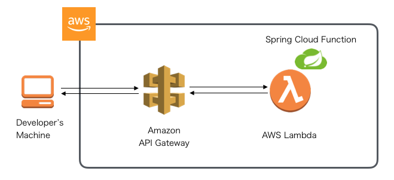
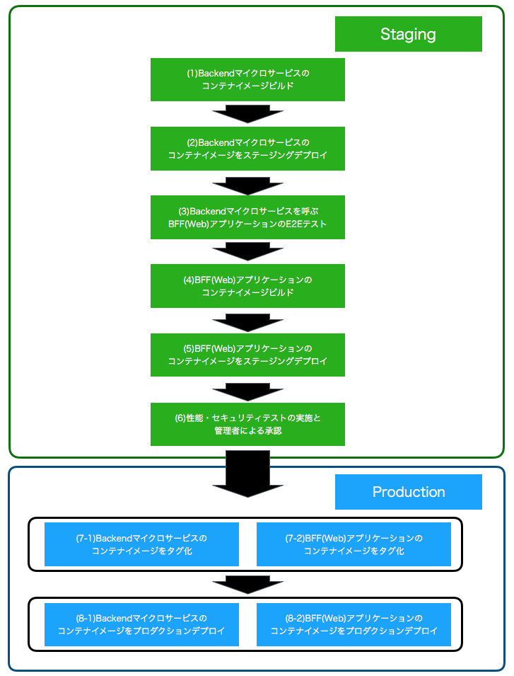
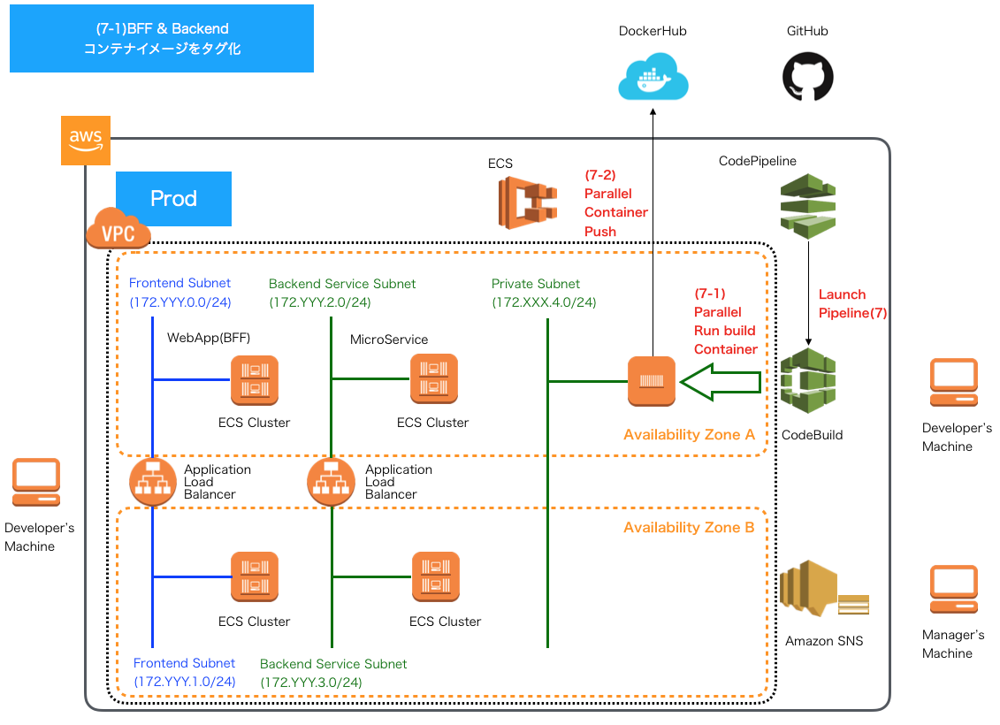
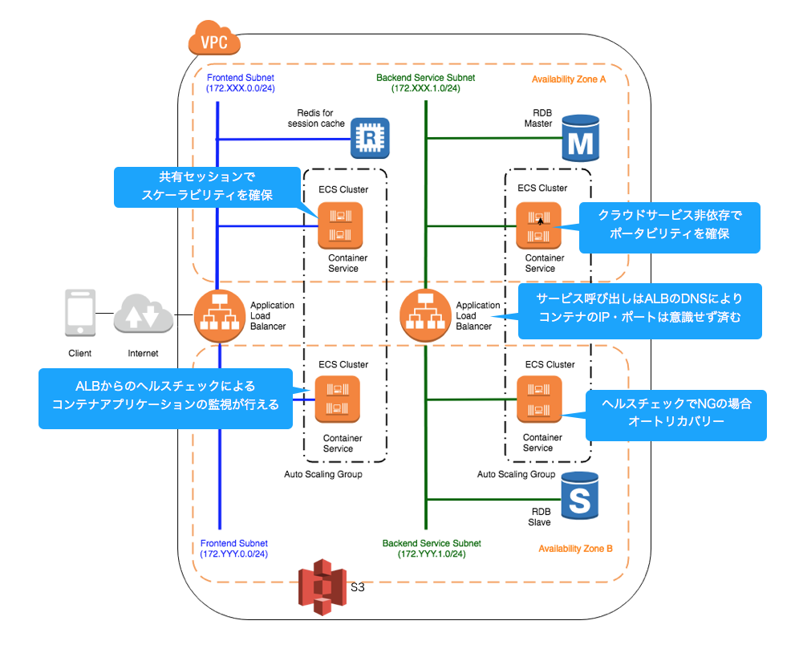

### JSUG 勉強会


<span style="font-size:28px">AWSで作るクラウドネイティブアプリケーションの基本とDevOps</span>


2019.9 @KoheiKawabata

---

### 自己紹介

<p></p>
<div style="margin: 100px 0px auto">
<ul>
  <div style="font-size:20px; margin:auto">
  <li style="margin: 10px 0px 10px">名前：川畑 光平(KAWABATA Kohei)</li>
  <li style="margin: 10px 0px 10px">会社：(株)NTTデータ</li>
  <li style="margin: 10px 0px 10px">今の仕事：プロジェクト支援(主にクラウド系)とR&amp;D</li>
  <li style="margin: 10px 0px 10px"><a href="https://aws.amazon.com/jp/blogs/psa/japan-apn-ambassador-2019/" target="_blank">2019 APN AWS Top Engineers &amp; Ambassadors</a></li>
  <li style="margin: 10px 0px 10px">マイナビ「ITSearch+」で記事連載中</li>
  </div>
</ul>
</div>

---

### 本日のトピックス


---

### その前に…

---

### How to use this slide

<br />

- ___黄色の文字はリンク___
- ___ESCキーを押すとスライドのオーバービュー___
- Altキー + マウスクリックで拡大ズーム
- J,K,M,Lキーでも遷移
- ___幾つかのスライドは下に遷移___

<span style="font-size:20px">
※当スライドは <a href="https://github.com/hakimel/reveal.js" target="_blank">「reveal.js」</a> を使って、GitHub Pages上に作成
</span>

---

### Agenda

- Backgroundと対象読者
- 記事オーバービュー
  - クラウドネイティブアプリケーション
  - DevOps
- 各テーマのポイント・補足
- 今後の記事公開予定

---

#### Background

<ul>
  <span style="font-size:24px">
    <li style="margin: 10px 0px 10px">
    Springのガイドラインは社内にもあったが、よく使われるAWSサービスの概要や使い方・設定方法などがドキュメントとして抜け落ちていた。
    </li>
    <li style="margin: 10px 0px 10px">
    ここ最近で支援したAWSプロジェクトでアプリケーション実装、R&D検証した内容を別のプロジェクトでも利用可能なよう汎用化
    </li>
    <li style="margin: 10px 0px 10px">
    幾つかのテーマに関して、AWSパートナーソリューションアーキテクトとも議論、内容を全社向けにフィードバック
    </li>
    <li style="margin: 10px 0px 10px">
    どうせなら社外に公開(マイナビへWeb記事として寄稿)※記事としてはまとめることができたが、色々数えきれないトラブルシューティングがあって苦労したので、そういった情報は共有して、できる限り、同業エンジニアの労力を軽減したい想い。
    </li>
  </span>
</ul>

---

#### 記事の対象読者

<ul>
  <span style="font-size:20px">
    <li style="margin: 15px 0px 15px">
    できるだけ学習コスト低く、AWSをベースとしたクラウドネイティブなアプリケーション開発のポイントを知りたい。とはいえ、最低以下のような経験は必要。
      <ul>
        <li>Java・SpringFrameworkを使ったことがある経験者</li>
        <li>Unix・LinuxなどのPOSIX系OS、Dockerコンテナを使ったことがある経験者</li>
        <li>MavenやGitといった開発ツールを使ったことがある経験者</li>
      </ul>
    </li>
    <li style="margin: 15px 0px 15px">
    AWSのマネージドサービスを可能な限り活用して、できるだけ少数のリソースで開発を行いたい。
    </li>
    <li style="margin: 15px 0px 15px">
    クラウドネイティブな実装方法からマイクロサービス、CI/CD、基盤自動化まで一貫したストーリーでのベースの雛形が欲しい。
    </li>
    <li style="margin: 15px 0px 15px">
    各テーマを一部切り取って、構築・実装の参考にしたい。
    </li>
  </span>
</ul>

***

### Article Overview


<span style="font-size:32px">AWSクラウドでよく利用される基本的なサービスの構築方法や、SpringBootをベースとしたアプリケーションを実装する際の基本事項をまとめた連載記事</span>

---

#### サーバレス編



<ul>
  <span style="font-size:24px">
  <li><a href="https://news.mynavi.jp/itsearch/article/devsoft/4316" target="_blank">(1)Spring Cloud Functionを使ったLambdaファンクション実装</a></li>
  <li><a href="https://news.mynavi.jp/itsearch/article/devsoft/4318" target="_blank">(2)AWS Lambdaの設定</a></li>
  <li><a href="https://news.mynavi.jp/itsearch/article/devsoft/4321" target="_blank">(3)Amazon API Gatewayの設定</a></li>
  </span>
</ul>

---

#### ECSコンテナ編


<div style="margin: 100px 0px auto">
<ul>
  <div style="font-size:18px">
  <li style="margin: 15px 0px 15px"><a href="https://news.mynavi.jp/itsearch/article/devsoft/4354" target="_blank">(4)VPC(Virtual Private Cloud)の構築</a></li>
  <li style="margin: 15px 0px 15px"><a href="https://news.mynavi.jp/itsearch/article/devsoft/4359" target="_blank">(5)ALB(Application Load Balancer)の構築</a></li>
  <li style="margin: 15px 0px 15px"><a href="https://news.mynavi.jp/itsearch/article/devsoft/4363" target="_blank">(6)SpringBootを使ったアプリケーション実装</a></li>
  <li style="margin: 15px 0px 15px"><a href="https://news.mynavi.jp/itsearch/article/devsoft/4390" target="_blank">(7)アプリケーションのDockerイメージの作成</a></li>
  <li style="margin: 15px 0px 15px"><a href="https://news.mynavi.jp/itsearch/article/devsoft/4405" target="_blank">(8)ECSクラスタの構築</a></li>
  <li style="margin: 15px 0px 15px"><a href="https://news.mynavi.jp/itsearch/article/devsoft/4408" target="_blank">(9)ECSタスクの定義</a></li>
  <li style="margin: 15px 0px 15px"><a href="https://news.mynavi.jp/itsearch/article/devsoft/4416" target="_blank">(10)ECSサービスの実行</a></li>
  </div>
</ul>
</div>
---

#### RDS(PostgreSQL)編


<ul>
  <div style="font-size:24px">
  <li><a href="https://news.mynavi.jp/itsearch/article/devsoft/4422" target="_blank">(11)RDS(RelationalDatabaseService)の構築</a></li>
  <li><a href="https://news.mynavi.jp/itsearch/article/devsoft/4426" target="_blank">(12〜13)Spring Cloud AWSとSpring Data JPAを使った実装</a></li>
  </div>
</ul>
---

#### NoSQL編


<ul>
  <div style="font-size:24px">
  <li style="margin: 10px 0px 10px"><a href="https://news.mynavi.jp/itsearch/article/devsoft/4473" target="_blank">(14)NoSQL基礎解説(CAP定理による分類)</a></li>
  <li style="margin: 10px 0px 10px"><a href="https://news.mynavi.jp/itsearch/article/devsoft/4479" target="_blank">(15)NoSQL基礎解説(AP型データベースの特徴)</a></li>
  </div>
</ul>

---

#### NoSQL編


<ul>
  <div style="font-size:24px">
  <li style="margin: 10px 0px 10px"><a href="https://news.mynavi.jp/itsearch/article/devsoft/4498" target="_blank">(16)AmazonDynamoDBの構築</a></li>
  <li style="margin: 10px 0px 10px"><a href="https://news.mynavi.jp/itsearch/article/devsoft/4506" target="_blank">(17〜18)Spring Data DynamoDBを使った実装</a></li>
  </div>
</ul>

---

#### NoSQL編


<div style="margin: 100px 0px auto">
<ul >
  <div style="font-size:18px">
  <li style="margin: 15px 0px 15px"><a href="https://news.mynavi.jp/itsearch/article/devsoft/4523" target="_blank">(19)ローカルRedisServerの構築</a></li>
  <li style="margin: 15px 0px 15px"><a href="https://news.mynavi.jp/itsearch/article/devsoft/4525" target="_blank">(20〜21)Spring SessionとSpring Data Redisを使った実装</a></li>
  <li style="margin: 15px 0px 15px"><a href="https://news.mynavi.jp/itsearch/article/devsoft/4543" target="_blank">(22)AmazonElastiCacheの構築</a></li>
  <li style="margin: 15px 0px 15px"><a href="https://news.mynavi.jp/itsearch/article/devsoft/4566" target="_blank">(23〜24)セッション共有するECSアプリケーション実装</a></li>
  </div>
</ul>
</div>


---

#### S3編


<ul>
  <div style="font-size:24px">
    <li><a href="https://news.mynavi.jp/itsearch/article/devsoft/4447" target="_blank">(25)AmazonS3バケットの構築とアップロード</a></li>
    <li><a href="https://news.mynavi.jp/itsearch/article/devsoft/4566" target="_blank">(26〜27)SpringCloudAWSを使ったファイルダウンロード・アップロード実装</a></li>
  </div>
</ul>

---

#### SQS編(今月から)


<ul>
  <div style="font-size:24px">
    <li>SQS+SpringCloudAWSを使用したオンライン非同期処理パターン(Producer)</li>
    <li>ディレードバッチやクラウドサービスイベントトリガーパターン</li>
    <li>SQS+SpringCloudAWS+SpringBatch+ECSTaskScheduler(Consumer)</li>
    <li><a href="https://github.com/debugroom/mynavi-sample-aws-sqs" target="_blank">現在実装のみ公開</a></li>
  </div>
</ul>


***
***
### Article Overview


<span style="font-size:32px">マイクロサービスアーキテクチャ(MSA)アプリケーションでDevOpsや基盤自動化する際の基本事項をまとめた連載記事</span>


---

<span style="font-size:24px">クラウドネイティブECSコンテナ編の環境でMSAアプリケーションを構築</span>


<ul>
  <span style="font-size:24px">
  <li><a href="https://news.mynavi.jp/itsearch/article/devsoft/4379" target="_blank">(1)MSAアプリケーションのOverview</a></li>
  </span>
</ul>

---

#### CI - 静的チェックツール環境導入編 -


<ul>
  <span style="font-size:24px">
  <li><a href="https://news.mynavi.jp/itsearch/article/devsoft/4463" target="_blank">(2)SonarQubeServerの構築</a></li>
  <li><a href="https://news.mynavi.jp/itsearch/article/devsoft/4466" target="_blank">(3)静的チェックルールの定義とSonarLintのIDEへの設定</a></li>
  </span>
</ul>

---

#### CI - SpringBootテストコード実装編 -


<ul>
  <span style="font-size:24px">
  <li><a href="https://news.mynavi.jp/itsearch/article/devsoft/4475" target="_blank">(4)マイクロサービスにおけるテスト自動化とテスト戦略</a></li>
  <li><a href="https://news.mynavi.jp/itsearch/article/devsoft/4486" target="_blank">(5)マイクロサービスアプリケーションのパッケージ構成</a></li>
  </span>
</ul>

---

<ul>
  <span style="font-size:32px">
  <li style="margin: 10px 0px 10px"><a href="https://news.mynavi.jp/itsearch/article/devsoft/4486" target="_blank">(5〜6)マイクロサービスにおける単体テストコード実装</a>
    <ul>
      <li style="margin: 10px 0px 10px">@DataJpaTestアノテーションの利用</li>
      <li style="margin: 10px 0px 10px">@SpringBootTestアノテーションの利用</li>
      <li style="margin: 10px 0px 10px">@WebMvcTestアノテーションの利用</li>
    </ul>
  </li>
  <li style="margin: 10px 0px 10px"><a href="https://news.mynavi.jp/itsearch/article/devsoft/4519" target="_blank">(7)マイクロサービスにおける結合テストコード実装</a>
    <ul>
      <li style="margin: 10px 0px 10px">DBUnitの利用</li>
      <li style="margin: 10px 0px 10px">TestRestTemplateの利用</li>
    </ul>
  </li>
  <li style="margin: 10px 0px 10px"><a href="https://news.mynavi.jp/itsearch/article/devsoft/4547" target="_blank">(8)マイクロサービスを呼び出す側の単体テストコード実装</a>
    <ul>
      <li style="margin: 10px 0px 10px">MockRestServiceServerの利用</li>
      <li style="margin: 10px 0px 10px">HTMLUnitの利用</li>
    </ul>
  </li>
  <li style="margin: 10px 0px 10px"><a href="https://news.mynavi.jp/itsearch/article/devsoft/4550" target="_blank">(9)マイクロサービスを含むEnd2Endテストコード実装</a>
    <ul>
      <li style="margin: 10px 0px 10px">Seleniumの利用</li>
    </ul>
  </li>
  </span>
</ul>

---

#### CI - AWS CodeBuildによるCI実践編 -


<ul>
  <span style="font-size:24px">
  <li><a href="https://news.mynavi.jp/itsearch/article/devsoft/4593" target="_blank">(10)CodeBuildの概要とCodeBuild Localの利用</a></li>
  <li><a href="https://news.mynavi.jp/itsearch/article/devsoft/4595" target="_blank">(11)CodeBuildの設定</a></li>
  </span>
</ul>

---

#### CI - AWS CodeBuildによるCI実践編 -

<span style="font-size:32px">GitHubフローをベースにしたブランチ戦略</span>


---

#### AWS CodePipelineによるCD実践編(今月から)



---

#### CD - AWS CodePipelineによるパイプライン1 -

<span style="font-size:24px">Backendコンテナイメージの作成・プッシュ</span>


---

#### CD - AWS CodePipelineによるパイプライン2 -

<span style="font-size:24px">ステージング環境へのBackendコンテナデプロイ</span>


---

#### CD - AWS CodePipelineによるパイプライン3 -

<span style="font-size:24px">WebアプリケーションでのE2Eテスト・コンテナイメージ作成</span>


---

#### CD - AWS CodePipelineによるパイプライン4 -

<span style="font-size:24px">Webアプリケーションのコンテナイメージのプッシュ</span>


---

#### CD - AWS CodePipelineによるパイプライン5 -

<span style="font-size:24px">ステージング環境へのWebアプリケーションのコンテナデプロイ</span>


---

#### CD - AWS CodePipelineによるパイプライン6 -

<span style="font-size:24px">ステージング環境でのその他テスト実行・管理者の承認プロセス</span>


---

#### CD - AWS CodePipelineによるパイプライン7 -

<span style="font-size:24px">Backend・Webアプリケーションのコンテナイメージの並行プッシュ</span>



---

#### CD - AWS CodePipelineによるパイプライン8 -

<span style="font-size:24px">プロダクション環境へのBackend・Webアプリケーションのコンテナ並行デプロイ</span>


---

#### 今後の記事公開の予定

- AWS CodeStarの利用
- AWS CloudFormationを使用した基盤自動化

***

### 各テーマのポイント・補足


***

#### サーバレス編


---

#### [補足]どうなの？サーバーレス

<div style="text-align:left">

<span style="font-size:24px">[利点]</span>
<ul>
  <span style="font-size:24px">
    <li style="margin: 10px 0px 10px">
    画像加工やエンコードなどとにかくマシンリソースを使う処理の場合、パフォーマンス影響を気にしなくて良い。
    </li>
    <li style="margin: 10px 0px 10px">
    S3ファイルアップロードなどのイベント後続処理といった形で、AWSクラウドサービスの連携が楽。
    </li>
  </span>
</ul>

<span style="font-size:24px">[イマイチ]</span>
<ul>
  <span style="font-size:24px">
    <li style="margin: 10px 0px 10px">
    SQSキュー、SNSへの連携、DynamoDBやRDSへのアクセスなどのLambda実装はボイラープレートコードが乱立しがち。Spring Cloud Function + Spring Cloud AWS + Spring Data XXXと組み合わせればかなりスッキリかける。
    </li>
    <li style="margin: 10px 0px 10px">
    エラー発生時の例外ハンドリング(ユーザへの通知やシステムメッセージどうするか)がいつも課題。同期的なハンドリングは難しく、デッドレターキューに投げつけるなど雑な対応しかできないのでは。
    </li>
    <li style="margin: 10px 0px 10px">
    デバッグやテストが大変。ServerlessFramework導入するしか手はないのか。
    </li>
  </span>
</ul>

</div>

***

***

#### ECSコンテナ編


---

#### [補足]なぜこの構成にしたの？

<span style="font-size:24px">A. 下記の案もありました。</span>


---

<span style="font-size:24px"> が、下記の理由によりやめました。</span>


---

<span style="font-size:22px"> 結局、この形にしました。しかし、この構成が唯一の正解というわけではありません。</span>


---

<span style="font-size:22px"> ただし、以下のようなメリットを得ることはできます。</span>



---

#### [補足]その他ツッコミ

<div style="text-align:left">
<span style="font-size:24px">
Q.　アプリケーションロードバランサーじゃなくて、Route53のServiceDiscoveryやAppMesh使わないの？
</span>

<br />
<br />

<span style="font-size:24px">
A.　ALBだとパスベースルーティング [http://service.com/xxxxxのxxxx] でコンテナごとにリクエストを振り分けられるのでALBにしてます。
AppMeshは最近出てきたサービスなのでまだ試してません。将来的に検証する予定です。
サービスの切り出し単位によっても異なりますし、将来的な意味でも、現在の構成が唯一の正解ではないと思います。
</span>
</div>

---

#### [補足]その他ツッコミ

<div style="text-align:left">

<span style="font-size:24px">
Q.　EKS(Elastic Kubernetes Service)は使わないの？
</span>

<br />
<br />

<span style="font-size:24px">
A.　EKSが東京リージョンにリリースする前に検討していたので、いったん見送りました。それにECSが想定していた以上にオーケストレーションとして優秀だったこと(ALBとECSコンテナ間のポートマッピングやセキュリティ制御、Dockerコンテナの再利用性など不足が感じられなかったこと)や、また、後述するCodeBuild、CodePipelineとのCI、CD連携は現在もEKSよりECSの方が一日の長があります。ただし、Kubernetesの使用はベンダロックインの観点から採用頻度が高いので今後検証する予定です。
</span>

</div>

***
***

#### RDS編


---

#### [補足]Spring Cloud AWS必要？

<div style="text-align:left">
<span style="font-size:24px">
Q.　従来通りDB接続設定すればいいのでは？
</span>

<br />

<span style="font-size:24px">
A.　設定が簡潔にかけるのがメリットかと思います。
</span>

<br />
<span style="font-size:18px">設定クラス</span>
</div>

```java
@Configuration
@EnableRdsInstance(
        dbInstanceIdentifier = "${rds.identifier}",
        password ="${rds.password}",
        readReplicaSupport = false)
public class RdsConfig {
}
```

<div style="text-align:left">
<span style="font-size:18px">application.yml</span>
</div>

```yml
rds:
  identifier: ${RDS_IDENTIFIER}
  password: ${RDS_PASSWORD}
```

***

***

#### NoSQL編


---

<span style="font-size:32px">[ポイント]各データベースに適したユースケースやデータ特性</span>

<br/>

<div style="font-size:18px">
<table style="padding:10px 0 10px">
  <thead>
    <tr>
      <th><span style="font-size:22px">タイプ</span></th>
      <th><span style="font-size:22px">ユースケース/データ特性</span></th>
      <th><span style="font-size:22px">使いどころ</span></th>
    </tr>
  </thead>
  <tbody>
  <tr>
      <td style="padding:10px 4px 10px" rowspan="3">CA型</td>
      <td style="padding:10px 4px 10px">複雑な条件</td>
      <td style="padding:10px 4px 10px">集合関数や射影/結合/副問い合わせ等</td>
    </tr>
    <tr>
      <td style="padding:10px 4px 10px">厳密なトランザクション/整合性</td>
      <td style="padding:10px 4px 10px">多額の決済データ、人命に関わるようなデータ</td>
    </tr>
    <tr>
      <td style="padding:10px 4px 10px">高負荷アップデート</td>
      <td style="padding:10px 4px 10px">正規化を前提としたデータモデル</td>
    </tr>
    <tr>
      <td style="padding:10px 4px 10px" rowspan="2">CP型</td>
      <td style="padding:10px 4px 10px">キャッシュ</td>
      <td style="padding:10px 4px 10px">一部が利用できなくても大きな問題はない</td>
    </tr>
    <tr>
      <td style="padding:10px 4px 10px">高速バッチ処理</td>
      <td style="padding:10px 4px 10px">シャーディングによる高速処理</td>
    </tr>
    <tr>
      <td style="padding:10px 4px 10px" rowspan="3">AP型</td>
      <td style="padding:10px 4px 10px">スケーラブルアプリケーション</td>
      <td style="padding:10px 4px 10px">ノードの追加を動的に行いたい</td>
    </tr>
    <tr>
      <td style="padding:10px 4px 10px">マルチリージョン</td>
      <td style="padding:10px 4px 10px">グローバルなデータセンタ間のデータ共有</td>
    </tr>
    <tr>
      <td style="padding:10px 4px 10px;border-bottom:1px white solid">大量の書き込み</td>
      <td style="padding:10px 4px 10px;border-bottom:1px white solid">単一障害点がないため、IoTセンサーデータなど大量書き込み</td>
    </tr>
  </tbody>
</table>
</div>

---

#### クラウドネイティブなAP型データベース


---

<div style="text-align:left">
<span style="font-size:24px">
[補足]<a href="https://github.com/debugroom/mynavi-sample-spring-data-dynamodb" target="_blank">Spring Data DynamoDBのサンプル</a>や
<a href="https://github.com/debugroom/mynavi-sample-spring-data-cassandra" target="_blank">Spring Data Cassadraを使ったサンプル</a>実装は紹介しているが、AP型データモデルはどう設計すればよいか？
</span>

<br />
<br />

<ul>
  <span style="font-size:18px">
  <li>AWSで作るクラウドネイティブアプリケーション(発展編)で解説予定</li>
  <li style="margin: 10px 0px 10px">ただ、当面先になるのでポイントだけ列挙
    <ul>
      <li style="margin: 10px 0px 10px">1:1や1:Nのような関係のデータモデルだとRDBと同じような形でもそんなに問題はない</li>
      <li style="margin: 10px 0px 10px">ただし、キー以外の検索ができないので、それ以外の項目で検索をかける場合はインデックスを作っておく</li>
      <li style="margin: 10px 0px 10px">N:Nの関連になるようなデータモデルはRDBと同じように関連実体(学生エンティティと講義エンティティの間にある受講のような実体でキーだけのインデックステーブル)を作っておくとうまくいくケースも多い</li>
      <li style="margin: 10px 0px 10px">テーブルのJOINは当然できないので、アプリ側でデータを取ってきてから加工する手法を使う</li>
      <li style="margin: 10px 0px 10px">設計の最初はまずデータアクセスのユースケースを洗い出すこと。</li>
      <li style="margin: 10px 0px 10px">参照は検索キーを注意していれば良いが、非正規化されたデータだと更新処理がしんどい(現実的でない)場合があるので、従来通りRDBを使う(あるいは併用する)ことも検討する</li>
      <li style="margin: 10px 0px 10px">大量書き込み時はプライマリキーにUUIDや乱数などで書き込むノードを分散させる。</li>
      <li style="margin: 10px 0px 10px">ホットデータとコールドデータでテーブルを分けること</li>
    </ul>
  </li>
  </span>
</ul>

<span style="font-size:16px">※余談 : AP型データストアのトラブルシューティングはかなりしんどい。サポートやマネージドに任せた方が断然楽。</span>

</div>

---

#### CP型のElastiCache(Redis)


---

#### ElastiCache Multi-AZ VS Redis Sentinel

<span style="font-size:32px">[補足]マルチAZでのフェイルオーバー</span>

<div style="font-size:24px">
<table style="padding:10px 0 10px">
  <thead>
    <tr>
      <th><span style="font-size:22px"></span></th>
      <th><span style="font-size:22px">ElastiCache Multi-AZ</span></th>
      <th><span style="font-size:22px">Redis Sentinel</span></th>
    </tr>
  </thead>
  <tbody>
    <tr>
      <td style="padding:10px 4px 10px; text-align:center">Spring Cloud AWS Support</td>
      <td style="padding:10px 4px 10px; text-align:center">○</td>
      <td style="padding:10px 4px 10px; text-align:center">×</td>
    </tr>
    <tr>
      <td style="padding:10px 4px 10px; text-align:center">Spring Data Redis Support</td>
      <td style="padding:10px 4px 10px; text-align:center">×</td>
      <td style="padding:10px 4px 10px; text-align:center">○</td>
    </tr>
    <tr>
      <td style="padding:10px 4px 10px; text-align:center">ダウンタイム</td>
      <td style="padding:10px 4px 10px; text-align:center">数分※</td>
      <td style="padding:10px 4px 10px; text-align:center">即時</td>
    </tr>
    <tr>
      <td style="padding:10px 4px 10px; text-align:center">AWSマネージド</td>
      <td style="padding:10px 4px 10px; text-align:center">○</td>
      <td style="padding:10px 4px 10px; text-align:center">×</td>
    </tr>
    <tr>
      <td style="padding:10px 4px 10px; text-align:center">エンドポイント変更</td>
      <td style="padding:10px 4px 10px; text-align:center">なし</td>
      <td style="padding:10px 4px 10px; text-align:center">あり</td>
    </tr>
  </tbody>
</table>
</div>
<br/>
<div style="font-size:24px; text-align:left">
<span style="font-size:18px">※エラーハンドリングが必要</span><br/>
<span style="font-size:18px">参考：<a href="https://www.slideshare.net/AmazonWebServicesJapan/aws-amazon-elast" target="_blank">[AWSマイスターシリーズ] Amazon ElastiCache</a></span>
</div>

***
***

#### S3編


---

<span style="font-size:24px">[ポイント]認証キーの取り扱い方 - よくない例 - </span> :scream:
<pre style="font-size:14px"><code class="java" data-noescape>
@Configuration
public class S3Config {

    @Value("${cloud.aws.credentials.accessKey}")
    private String accessKey;

    @Value("${cloud.aws.credentials.secretKey}")
    private String secretKey;

    @Value("${cloud.aws.region.static}")
    private String region;

    @Bean
    public BasicAWSCredentials basicAWSCredentials() {
        return new BasicAWSCredentials(accessKey, secretKey);
    }

    @Bean
    public AmazonS3 amazonS3Client(AWSCredentials awsCredentials) {
        return AmazonS3ClientBuilder.standard().withRegion(Regions.fromName(region)).build();
    }
}
</code></pre>

<pre style="font-size:14px"><code class="java" data-noescape>

cloud.aws.credentials.accessKey=XXXXXXXXXXXXXX
cloud.aws.credentials.secretKey=YYYYYYYYYYYYYY
cloud.aws.region.static=ap-northeast-1
cloud.aws.region.auto=false

</code></pre>

---
<span style="font-size:24px">[ポイント]認証キーの取り扱い方 - よい例 - </span> :thumbsup:

<pre style="font-size:18px"><code class="java" data-noescape>

@Configuration
public class S3Config {

    @Bean
    public AmazonS3 amazonS3(){
        return AmazonS3ClientBuilder.standard().build();
    }

}
</code></pre>

<ul>
  <span style="font-size:20px">
  <li style="margin: 10px 0px 10px">開発環境では、~/.aws/credentialsに開発用のアクセスキーと秘密キーをおいておく。</li>
  <li style="margin: 10px 0px 10px">本番環境ではEC2やECSコンテナにIAMロールを設定する。</li>
  </span>
</ul>

---

<div style="text-align:left">
<span style="font-size:24px">
[補足]ダメな理由
</span>

<br/>
<br/>
<ul>
  <span style="font-size:18px">
  <li>コードをGitHubのパブリックレポジトリにプッシュしたら、キーを探索しているボットに直ちに奪取される</li>
  <li style="margin: 10px 0px 10px">キーの部分を環境変数に変えてやっている例も割と見かけるが、オススメのやり方ではない。
    <ul>
      <li style="margin: 10px 0px 10px">環境変数で開発環境や本番環境ごとにキーを替える想定だと思われるが、上記の設定クラスのコード中で、AmazonS3ClientBuilder.standard().build()で内部的に呼ばれる<a href="https://github.com/aws/aws-sdk-java/blob/master/aws-java-sdk-core/src/main/java/com/amazonaws/auth/DefaultAWSCredentialsProviderChain.java" target="_blank">DefaultAWSCredentialsProviderChain</a>では、以下の順で認証情報を取得する</li>
        <ul>
          <li style="margin: 10px 0px 10px">環境変数AWS_ACCESS_KEY_IDとAWS_SECRET_ACCESS_KEY</li>
          <li style="margin: 10px 0px 10px">システムプロパティaws.accessKeyIdとaws.secretKey</li>
          <li style="margin: 10px 0px 10px">ユーザーのAWS認証情報ファイル(~/.aws/credentialsのこと)※</li>
          <li style="margin: 10px 0px 10px">AWSインスタンスプロファイルの認証情報</li>
        </ul>
      <li style="margin: 10px 0px 10px">つまりあえてプロパティファイルに環境変数を設定する必要はそもそもない</li>
      <li style="margin: 10px 0px 10px">本番環境は最後の「AWSインスタンスプロファイルの認証情報」でIAMロール経由で一時認証情報を取得することをAWSとして推奨している。</li>
      <li style="margin: 10px 0px 10px">本番環境用のキーを払い出すことがそもそもNG。従って、本番環境のキーを環境変数で切り替えるやり方はオススメではない</li>
      <li style="margin: 10px 0px 10px">AWSインスタンスプロファイルの認証情報の詳細は <a href="https://docs.aws.amazon.com/ja_jp/AWSEC2/latest/UserGuide/iam-roles-for-amazon-ec2.html" target="_blank">Amazon EC2 の IAM ロール</a>を参照のこと。</li>
    </ul>
  </li>
  </span>
</ul>

<span style="font-size:16px">
※2019.8.29時点で新たにWebIdentityTokenCredentialsProvider(WebフェデレーションIDトークン)も追加された模様。
</span>
</div>

---

<span style="font-size:24px">クラウド特有の実装：STSを使ったS3ダイレクトアップロード・ダウンロード</span>


<ul>
  <div style="font-size:24px">
    <li>AWSで作るクラウドネイティブアプリケーション発展編(仮)で解説予定</li>
    <li>アップロード後の後続処理はサーバレスと相性が良い</li>
    <li><a href="https://github.com/debugroom/mynavi-sample-aws-s3/tree/master/src/main/java/org/debugroom/mynavi/sample/aws/s3/app/web/helper" target="_blank">現在実装のみ公開</a></li>
  </div>
</ul>

***
***

#### SQS編


---

<span style="font-size:24px">[ポイント]SpringCloudAWSを使ったSQS Producer-Consumerアプリケーション</span>
<span style="font-size:24px">Producer設定クラス</span>
<pre style="font-size:16px"><code class="java" data-noescape>
@Configuration
public class SqsConfig {

    @Value("${queue.endpoint}")
    private String queueEndpoint;
    @Value("${cloud.aws.region.static}")
    private String region;

    @Autowired
    AmazonSQSAsync amazonSQSAsync;

    @Bean
    public AwsClientBuilder.EndpointConfiguration endpointConfiguration(){
        return new AwsClientBuilder.EndpointConfiguration(queueEndpoint, region);
    }

    @Bean
    public QueueMessagingTemplate queueMessagingTemplate(){
        return new QueueMessagingTemplate(amazonSQSAsync);
    }

}
</code></pre>
---

<span style="font-size:24px">[ポイント]SpringCloudAWSを使ったSQS Producer-Consumerアプリケーション</span>
<span style="font-size:24px">ProducerRepository</span>

<pre style="font-size:18px"><code class="java" data-noescape>

import org.springframework.cloud.aws.messaging.core.QueueMessagingTemplate;

@Component
public class SampleRepositoryImpl implements SampleRepository{

    @Autowired
    QueueMessagingTemplate queueMessagingTemplate;

    @Override
    public void save(Sample sample) {
        queueMessagingTemplate.convertAndSend(
          "MynaviSampleSqsQueue", sample.getMessage());
    }

}
</code></pre>

---


<span style="font-size:24px">[ポイント]SpringCloudAWSを使ったSQS Producer-Consumerアプリケーション</span>
<span style="font-size:24px">Consumer設定クラス</span>
<pre style="font-size:16px"><code class="java" data-noescape>
@Configuration
public class SqsConfig {

    @Value("${queue.endpoint}")
    private String queueEndpoint;
    @Value("${cloud.aws.region.static}")
    private String region;

    @Autowired
    AmazonSQSAsync amazonSQSAsync;

    @Bean
    public AwsClientBuilder.EndpointConfiguration endpointConfiguration(){
        return new AwsClientBuilder.EndpointConfiguration(queueEndpoint, region);
    }

}
</code></pre>

---
<span style="font-size:24px">[ポイント]SpringCloudAWSを使ったSQS Producer-Consumerアプリケーション</span>
<span style="font-size:24px">Consumer</span>
<pre style="font-size:16px"><code class="java" data-noescape>
@EnableSqs
public class MessageListener {

    @Autowired
    JobLauncher jobLauncher;

    @Autowired
    Job job;

    @SqsListener(value = "MynaviSampleSqsQueue", deletionPolicy = SqsMessageDeletionPolicy.ON_SUCCESS)
    public void onMessage(String message) throws
            JobExecutionAlreadyRunningException, JobRestartException,
            JobInstanceAlreadyCompleteException, JobParametersInvalidException {
        Map<String, JobParameter> jobParameterMap = new HashMap<>();
        jobParameterMap.put("param", new JobParameter(message));
        jobParameterMap.put("time", new JobParameter(System.currentTimeMillis()));
        JobParameters jobParameters = new JobParameters(jobParameterMap);
        JobExecution jobExecution = jobLauncher.run(job, jobParameters);
        ExecutionContext executionContext = jobExecution.getExecutionContext();
    }

}

</code></pre>

---

<span style="font-size:24px">[補足]SQS Queueを刈り取って実行するSpring Batchのサンプル</span>


***

### 各テーマのポイント・補足


***

<span style="font-size:24px">クラウドネイティブECSコンテナ編の環境でMSAアプリケーションを構築</span>


---

<span style="font-size:24px">クラウドネイティブECSコンテナ編の環境でMSAアプリケーションを構築</span>

<div style="text-align:left">
<span style="font-size:24px">
[補足]マイクロサービスとは言っているが、記事中では、どのようにサービスを分割するか、プロジェクトやアプリケーションコンポーネントの構成など事例は出したが、ベストプラクティスまで踏み込んだ議論はしていない
</span>

<br />
<br />

<ul>
  <span style="font-size:18px">
  <li>DDDやオーケストレーション、コレオグラフィなどテーマが多岐に渡るので一旦省略。うまくサービス分割して、Controller、Service、Repositoryで実装が完了した想定</li>
  <li style="margin: 10px 0px 10px">ただ、幾つかのプロジェクトでチャレンジした結果、以下のような場合は上手くいかない(マイクロサービス化の目的を達成できない)。
    <ul>
      <li style="margin: 10px 0px 10px">過度の共通化(影響が大きくなって逆にアジリティを損なう)</li>
      <li style="margin: 10px 0px 10px">アプリケーション規模が大きすぎる(関係者も多くなるので。スモールスタートがよいのでは)</li>
      <li style="margin: 10px 0px 10px">マイクロサービス化の目的が明確でない(単に複雑になっただけ。モノリスの方が向いてたんじゃ…)</li>
      <li style="margin: 10px 0px 10px">最初から完璧なモノを作ろうとする(リファクタリングを前提に考えた方がよい)</li>
      <li style="margin: 10px 0px 10px">原理原則にこだわりすぎる(12FactorAppも全て満たすのすごく大変)</li>
    </ul>
  </li>
  </span>
</ul>

</div>
<span style="font-size:16px">
素早くアプリを作って、早く世の中にサービスを提供したいのではなかったのか…
</span>

***
***

#### CI - 静的チェックツール環境導入編 -


---
<span style="font-size:24px">
[ポイント]SonarQubeServerをALB+ECS+RDSで構成のメリット
</span>

<ul>
  <li style="font-size:24px">ALB+ECSコンテナの運用で可用性を向上</li>
  <li style="font-size:24px">データベースをRDSにすることにより、バックアップ等保全性が向上　</li>
</ul>

---

<span style="font-size:24px"><a href="https://sonar.spring.io/projects?sort=-size" target="_blank">Spring.ioプロジェクトのSonarqubeプロジェクト</a>はどうなっているか？</span>


***

```java
public class HelloWorld {
  public static void main(String[] args) {
      System.out.println("Hello World!");
  }
}
```


---
